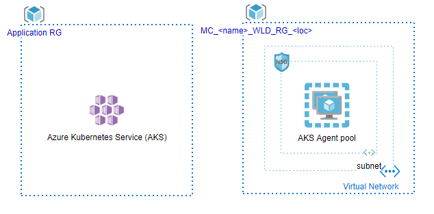

[[_TOC_]]

# **Azure Kubernetes Service (AKS)**

## Overview

### Acronym
Acronym for the product is **aks**. Check [List of Acronyms](https://confluence.ci.gsnet.corp/display/OPTIMUM/List%2Bof%2BAcronyms) for a complete list of acronyms.

### Description
> Azure Kubernetes Service (AKS) manages your hosted Kubernetes environment, making it quick and easy to deploy and manage containerized applications without container orchestration expertise. It also eliminates the burden of ongoing operations and maintenance by provisioning, upgrading, and scaling resources on demand, without taking your applications offline.

### Version
|Version|Target SCF|
|:--|:--|
|0.1|S0|

### Dependencies
The following resources must exist before the deployment can take place:

Resources given by the Cloud Competence Center that need to be in place:
- Azure Subscription
- Resource Group
- Azure Active Directory Tenant
- Azure Active Directory service principal to interact with other Azure resources.

### Target Audience
|Audience |Purpose  |
|--|--|
| Cloud Center of Excellence | Understand the Design of this Service |
| Cybersecurity Hub | Understand how the Security Framework is implemented in this Service and who is responsible of each control |
| Service Management Hub | Understand how the Service can be managed according to the Service Management Framework |

## Architecture

## Networking

### Network topology

### Exposed product endpoints
The following endpoints can be used to consume or manage the Certified Product:

#### Management endpoints (Control Plane)
These endpoints will allow to make changes in the configuration of the Certified Service, change permissions or make application deployments.
|EndPoint|IP/URL|Protocol|Port|Authorization|
|:-|:-|--|--|:-|
|[Define all existing]|[Define all existing]||||

Links (if any) in the Azure documentation related to this endpoint(s ):
- Azure Resource Management REST API: https://docs.microsoft.com/en-us/rest/api/resources/
- [Link to Azure documentation for more detailed explanation]

#### Consumption endpoints (Data Plane)
These endpoints will allow you to consume the Certified Service from an application perspective.
|EndPoint|IP/URL  |Protocol|Port|Authorization|
|:-|:-|--|--|:-|
|[Define all existing]|[Define all existing]||||

Links (if any) in the Azure documentation related to this endpoint(s):
- https://docs.microsoft.com/en-us/rest/api/aks/

## Other Limitations
- Azure limits per subscription (https://docs.microsoft.com/en-us/azure/azure-subscription-service-limits) 
- Resource limits: [https://docs.microsoft.com/en-us/azure/sql-database/sql-database-resource-limits-logical-server]
- [Other limitations] 

# **Security Framework**
This section explains how the different aspects to have into account in order to meet the Security Control Framework for this Certified Service.

## Security Controls based on Security Control Framework

### Foundation (S0) Controls for Rated Workloads
|F#|What|Description|How it is implemented in the Product|Who|
|--|:-|:-|:-|--|
||||||

### Standard (S1) Controls for Rated Workloads
|S#|What|Description|How it is implemented in the Product|Who|
|--|:-|:-|:-|--|
||||||

### Complementary Advanced (S2) Controls for Rated Workloads
|S#|What|Description|How it is implemented in the Product|Who|
|--|:-|:-|:-|--|
||||||

# **Product Artifacts**

This section explain the structure and elements that represent the artifacts of product.

|Folder|Name|Description
|--|:-|--|
|Documentation|productname-network-diagram.pptx|Network topology diagram|
|Documentation|productname-architecture-diagram.pptx|Network architecture diagram|
|Root|Readme.md|Product documentation file|
|Root|main.tf|Terraform file to use in pipeline to build and release a product|
|Root|outputs.tf|Terraform file to use in pipeline to check output|
|Root|variables.tf|Terraform file to use in pipeline to configure product|

# **Links to internal documentation**
**Reference documents** :  
- [List of Acronyms](https://confluence.ci.gsnet.corp/display/OPTIMUM/List%2Bof%2BAcronyms)
- [Naming Convention for Repos](/Naming-Convention-for-Repos)
- [Repo module strategy for terraform](/Way-of-Working/Products/Branching-Strategy/Repo-module-strategy-for-terraform)
- [Product Portfolio](/Cloud-Center-of-Excellence-\(CCoE\)/Product-Portfolio)
- [Naming Convention for Azure Resources](/DevOps-QuickStart/Naming-Convention-for-Azure-Resources)